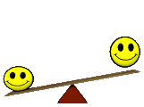

# Hello
Hi, I'm Mike. An engineer for this website you are looking at right now. I build GitHub [Actions](https://github.com/features/actions), which is used to generate this page.

## Sleep
Stats pulled from a whoop band that I wear 24/7.

<sleep-stats>

## Latest tweet
[" width="400">](<tweet-url>)

## Top <star-count> friends ⭐️
<stars>

*Star [this repo](https://github.com/mscoutermarsh/mscoutermarsh), to add yourself here.*

### How this works
This is autogenerated by a Ruby script that runs on Actions. [See it here](https://github.com/mscoutermarsh/mscoutermarsh).

